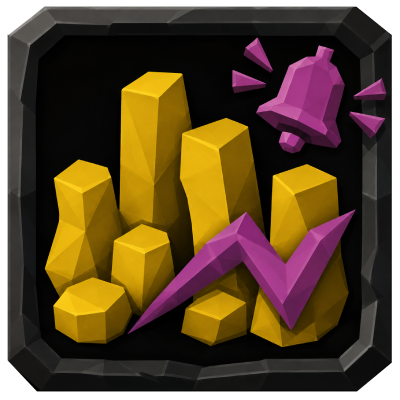
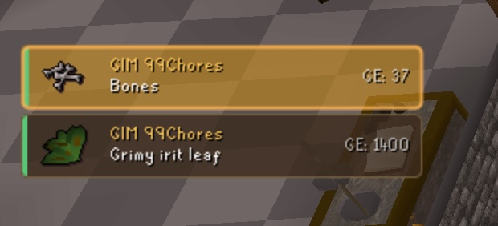
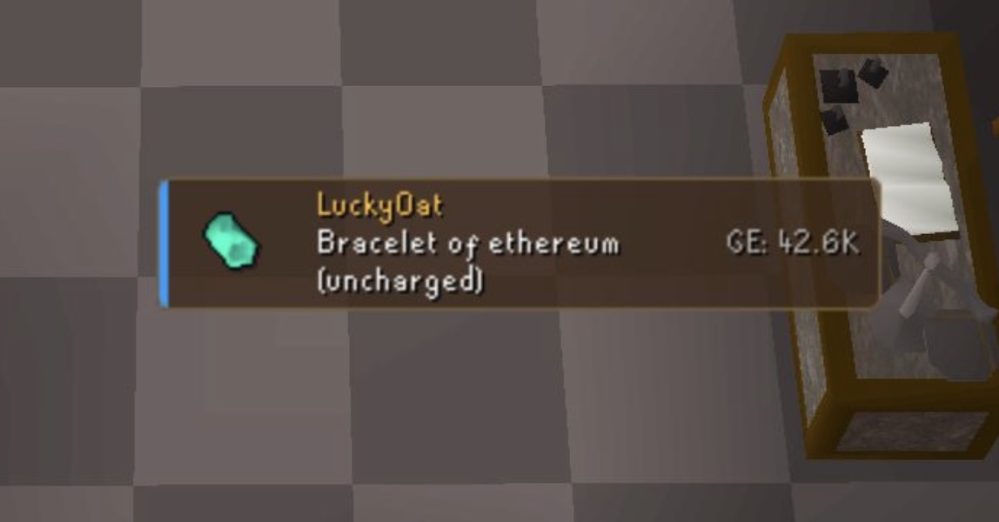

  

# Better Loot Notifier

Shows loot as small cards on the left of the screen instead of only as chat text.

Each card has the player's name, the item, its icon and its value. Cards stack up and fade out after
a few seconds.

## What it shows

- **Boss loot:** the green line naming whoever dealt the most damage at bosses such as General
  Graardor etc, plus raid special loot in CoX, ToB and ToA.
- **Group Ironman broadcasts:** a group ironman's member's drop(s)
- **Your own drops.**

A coloured bar on the left edge of each card marks which of the three it came from.

Cards are ordered by importance rather than by time. Highlighted items come first, then the most
valuable ones.

## Settings

- **Highlighted items:** a comma-separated list. A match gets a brighter card, plays an alert sound,
  and always shows regardless of the other filters.
- **Minimum value:** hides loot worth less than this. Group broadcasts are judged on the value the
  game itself states, so untradeables are handled correctly.
- **Max cards** and **Display time:** how many cards show at once, and how long each one lasts.

Colours, card width, the alert sound and the rest are in the config panel.

Hold Alt and drag to move the stack. A sample card appears while Alt is held, so there is something
to grab when the stack is empty.

## Ground Items

Turn on **Use Ground Items lists** to reuse that plugin's Hidden items and Highlighted items, so
anything already sorted out on the floor does not need listing twice. Wildcards such as `*rune*`
work in both.

Your own lists take priority. Coins hidden on the ground, plus `Always show: Coins` here, still
gives you a card.

## License

[BSD 2-Clause](LICENSE). Alert sound credits are in [ATTRIBUTION.md](ATTRIBUTION.md).
